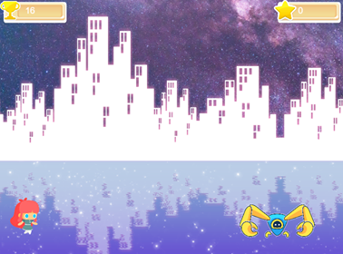

# Capstone Javascript

> Avoid the obstacles and gain as many points as you can!



## Mechanics
The player stays still at the left of the screen, the player can make one simple jump or a double jump using the space key.

After a few seconds, enemies will appear from the right of the screen and will approach the player, the player should avoid the mechanical crabs by jumping.

The player continually earns points just by being alive. You can win extra points by collecting the balloons with stars inside them.

The player only has one life, so the moment the player touches a crab is game over

## Design Process

For this project, I had to learn to use Phaser, which was quite a challenge, not because it is a difficult framework to learn, it was difficult because I have some experience programming videogames and Phaser 3 is not very good at it.
The challenge was to make a platformer game, just a still character on the left of the screen jump platform which goes towards it. I decided instead of platforms I would use some kind of obstacles the player has to sort. I had to figure out how to balance the spawn rate the enemies should have so the player can actually jump over them and not be stuck in a position where they couldn't do anything.

## Scenes 
- Boot: boots the game.
- Preloader: loads every asset needed for the game
- Options: disable or enable the background music
- Credits: just my name
- Scores: a list of the 10 highest scores ordered
- Game: the actual game where you play
- Game over: shows the total points the player made
- Submit score: Here the user can submit their name with the score to the API


## Built With

- HTML
- CSS
- JAVASCRIPT ES6
- PHASER 3
- WEBPACK
- JEST
- NODE
- BABEL

## Live Demo

[Live Demo Link](https://loving-dubinsky-957daf.netlify.app/)

## Getting Started

To get a local copy up and running follow these simple example steps.

### Prerequisites

- npm
- git

### Setup

- First, we need to clone the project, open your terminal and cd to the directory where you want the project to be in.
- Once inside the location, use the following command to get a copy of this repository.
```
git clone git@github.com:JohannRodriguez/javascript-capstone.git
```
- You can now cd into the newly created directory to start working.

### Install

- In your terminal, inside the project location, run the following command to install node packages:
```
npm install
```
- Followed by:
```
npm run build
```

### Usage

- Once we install everything we can start using the game, in your terminal run:
```
npm run start
```
- Wait for the project to compile, then open a new internet tab and go to this location as you would with any internet page:
```
http://localhost:3500/dist/
```

### Run tests

- To run tests use this command:
```
npm run test
```


## Authors

👤 **Johann Rodriguez**

- Github: [@JohannRodriguez](https://github.com/JohannRodriguez)
- Twitter: [@BSapce](https://https://twitter.com/BSapce)
- Linkedin: [Johann Rodríguez](https://www.linkedin.com/in/johann-alonso-rodriguez-vazquez/)

## 🤝 Contributing

Contributions, issues, and feature requests are welcome!

Feel free to check the [issues page](https://github.com/JohannRodriguez/capstone-javascript/issues/).

## Show your support

Give a ⭐️ if you like this project!

## 📝 License

This project is [MIT](lic.url) licensed.
